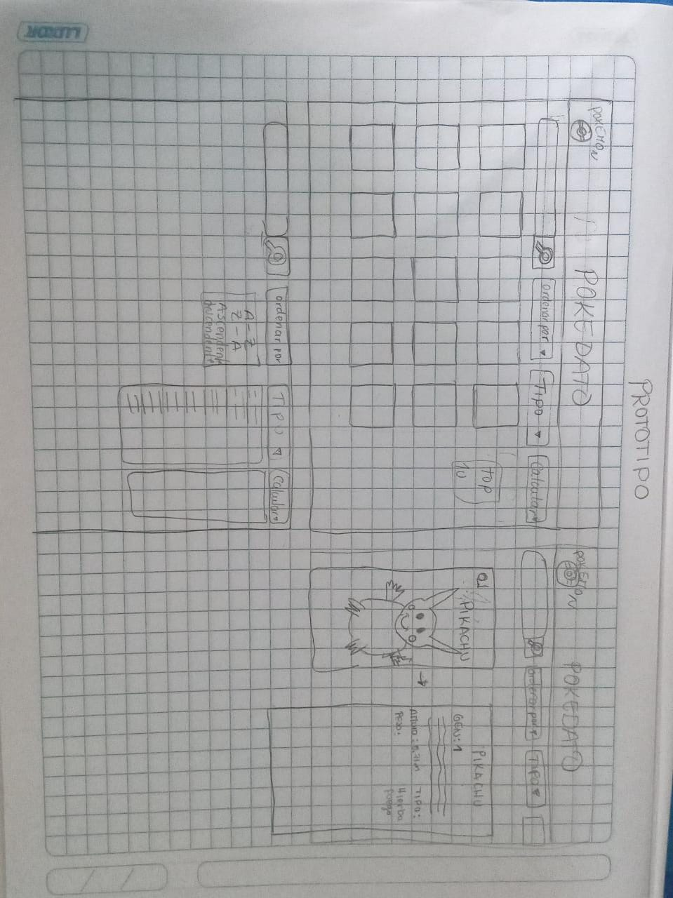
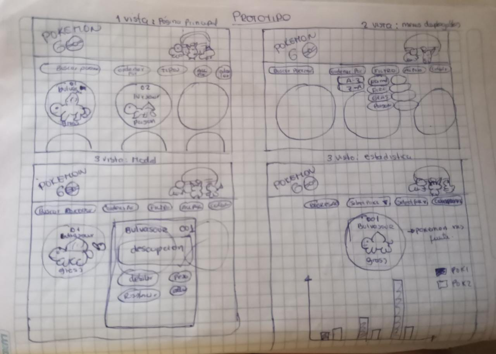
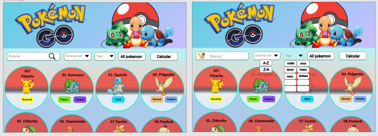
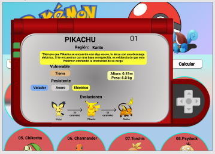
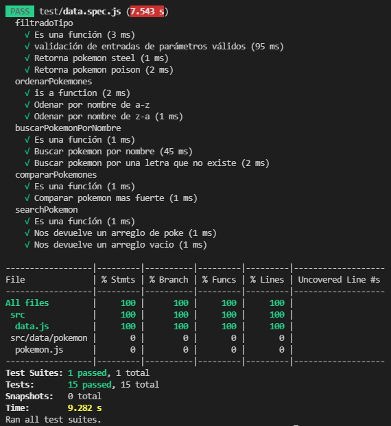

# DATA POKEMON

## Índice

* [1. Resumen del proyecto](#1-resumen-del-proyecto)
* [2. Objetivos de aprendizaje](#2-objetivos-de-aprendizaje)
* [3. Criterios de aceptación mínimos del proyecto](#3-criterios-de-aceptación-mínimos-del-proyecto)
* [4. Diseño de la interfaz de usuario](#4-diseño-de-la-interfaz-de-usuario)
* [5. Información de los usuarios](#5-información-de-los-usuarios)
* [6. Pruebas Unitarias](#6-pruebas-unitarias)
* [7. Checklist](#6-checklist)

***

## 1. Resumen del proyecto

    La aplicación web de pokemon data, se realizó con la intención de crear una enciclopedia, en la que cualquiera pueda consultar datos de todos los pokemones existentes, como las debilidades, resistencia, tipos, etc.

    Una información realmente útil tanto para jugadores que solo quieran saber algo del pokemon, como para los que busquen algún set competitivo de algún pokemon en concreto.

## 2. Objetivos de aprendizaje

    Reflexiona y luego marca los objetivos que has llegado a entender y aplicar en tu proyecto. Piensa en eso al decidir tu estrategia de trabajo.

### HTML

- [ ] **Uso de HTML semántico**

  

Links

  * [HTML semántico](https://curriculum.laboratoria.la/es/topics/html/02-html5/02-semantic-html)
  * [Semantics - MDN Web Docs Glossary](https://developer.mozilla.org/en-US/docs/Glossary/Semantics#Semantics_in_HTML)

### CSS

- [ ] **Uso de selectores de CSS**

  

Links

  * [Intro a CSS](https://curriculum.laboratoria.la/es/topics/css/01-css/01-intro-css)
  * [CSS Selectors - MDN](https://developer.mozilla.org/es/docs/Web/CSS/CSS_Selectors)

- [ ] **Modelo de caja (box model): borde, margen, padding**

  

Links

  * [Box Model & Display](https://curriculum.laboratoria.la/es/topics/css/01-css/02-boxmodel-and-display)
  * [The box model - MDN](https://developer.mozilla.org/en-US/docs/Learn/CSS/Building_blocks/The_box_model)
  * [Introduction to the CSS box model - MDN](https://developer.mozilla.org/en-US/docs/Web/CSS/CSS_Box_Model/Introduction_to_the_CSS_box_model)
  * [CSS display - MDN](https://developer.mozilla.org/pt-BR/docs/Web/CSS/display)
  * [display - CSS Tricks](https://css-tricks.com/almanac/properties/d/display/)

- [ ] **Uso de flexbox en CSS**

  

Links

  * [A Complete Guide to Flexbox - CSS Tricks](https://css-tricks.com/snippets/css/a-guide-to-flexbox/)
  * [Flexbox Froggy](https://flexboxfroggy.com/#es)
  * [Flexbox - MDN](https://developer.mozilla.org/en-US/docs/Learn/CSS/CSS_layout/Flexbox)

### Web APIs

- [ ] **Uso de selectores del DOM**

  

Links

  * [Manipulación del DOM](https://curriculum.laboratoria.la/es/topics/browser/02-dom/03-1-dom-methods-selection)
  * [Introducción al DOM - MDN](https://developer.mozilla.org/es/docs/Web/API/Document_Object_Model/Introduction)
  * [Localizando elementos DOM usando selectores - MDN](https://developer.mozilla.org/es/docs/Web/API/Document_object_model/Locating_DOM_elements_using_selectors)

- [ ] **Manejo de eventos del DOM (listeners, propagación, delegación)**

  

Links

  * [Introducción a eventos - MDN](https://developer.mozilla.org/es/docs/Learn/JavaScript/Building_blocks/Events)
  * [EventTarget.addEventListener() - MDN](https://developer.mozilla.org/es/docs/Web/API/EventTarget/addEventListener)
  * [EventTarget.removeEventListener() - MDN](https://developer.mozilla.org/es/docs/Web/API/EventTarget/removeEventListener)
  * [El objeto Event](https://developer.mozilla.org/es/docs/Web/API/Event)

- [ ] **Manipulación dinámica del DOM**

  

Links

  * [Introducción al DOM](https://developer.mozilla.org/es/docs/Web/API/Document_Object_Model/Introduction)
  * [Node.appendChild() - MDN](https://developer.mozilla.org/es/docs/Web/API/Node/appendChild)
  * [Document.createElement() - MDN](https://developer.mozilla.org/es/docs/Web/API/Document/createElement)
  * [Document.createTextNode()](https://developer.mozilla.org/es/docs/Web/API/Document/createTextNode)
  * [Element.innerHTML - MDN](https://developer.mozilla.org/es/docs/Web/API/Element/innerHTML)
  * [Node.textContent - MDN](https://developer.mozilla.org/es/docs/Web/API/Node/textContent)

### JavaScript

- [ ] **Diferenciar entre tipos de datos primitivos y no primitivos**

- [ ] **Arrays (arreglos)**

  

Links

  * [Arreglos](https://curriculum.laboratoria.la/es/topics/javascript/04-arrays)
  * [Array - MDN](https://developer.mozilla.org/es/docs/Web/JavaScript/Reference/Global_Objects/Array/)
  * [Array.prototype.sort() - MDN](https://developer.mozilla.org/es/docs/Web/JavaScript/Reference/Global_Objects/Array/sort)
  * [Array.prototype.forEach() - MDN](https://developer.mozilla.org/es/docs/Web/JavaScript/Reference/Global_Objects/Array/forEach)
  * [Array.prototype.map() - MDN](https://developer.mozilla.org/es/docs/Web/JavaScript/Reference/Global_Objects/Array/map)
  * [Array.prototype.filter() - MDN](https://developer.mozilla.org/es/docs/Web/JavaScript/Reference/Global_Objects/Array/filter)
  * [Array.prototype.reduce() - MDN](https://developer.mozilla.org/es/docs/Web/JavaScript/Reference/Global_Objects/Array/Reduce)

- [ ] **Objetos (key, value)**

  

Links

  * [Objetos en JavaScript](https://curriculum.laboratoria.la/es/topics/javascript/05-objects/01-objects)

- [ ] **Variables (declaración, asignación, ámbito)**

  

Links

  * [Valores, tipos de datos y operadores](https://curriculum.laboratoria.la/es/topics/javascript/01-basics/01-values-variables-and-types)
  * [Variables](https://curriculum.laboratoria.la/es/topics/javascript/01-basics/02-variables)

- [ ] **Uso de condicionales (if-else, switch, operador ternario, lógica booleana)**

  

Links

  * [Estructuras condicionales y repetitivas](https://curriculum.laboratoria.la/es/topics/javascript/02-flow-control/01-conditionals-and-loops)
  * [Tomando decisiones en tu código — condicionales - MDN](https://developer.mozilla.org/es/docs/Learn/JavaScript/Building_blocks/conditionals)

- [ ] **Uso de bucles/ciclos (while, for, for..of)**

  

Links

  * [Bucles (Loops)](https://curriculum.laboratoria.la/es/topics/javascript/02-flow-control/02-loops)
  * [Bucles e iteración - MDN](https://developer.mozilla.org/es/docs/Web/JavaScript/Guide/Loops_and_iteration)

- [ ] **Funciones (params, args, return)**

  

Links

  * [Funciones (control de flujo)](https://curriculum.laboratoria.la/es/topics/javascript/02-flow-control/03-functions)
  * [Funciones clásicas](https://curriculum.laboratoria.la/es/topics/javascript/03-functions/01-classic)
  * [Arrow Functions](https://curriculum.laboratoria.la/es/topics/javascript/03-functions/02-arrow)
  * [Funciones — bloques de código reutilizables - MDN](https://developer.mozilla.org/es/docs/Learn/JavaScript/Building_blocks/Functions)

- [ ] **Pruebas unitarias (unit tests)**

  

Links

  * [Empezando con Jest - Documentación oficial](https://jestjs.io/docs/es-ES/getting-started)

- [ ] **Módulos de ECMAScript (ES Modules)**

  

Links

  * [import - MDN](https://developer.mozilla.org/es/docs/Web/JavaScript/Reference/Statements/import)
  * [export - MDN](https://developer.mozilla.org/es/docs/Web/JavaScript/Reference/Statements/export)

- [ ] **Uso de linter (ESLINT)**

- [ ] **Uso de identificadores descriptivos (Nomenclatura y Semántica)**

- [ ] **Diferenciar entre expresiones (expressions) y sentencias (statements)**

### Control de Versiones (Git y GitHub)

- [ ] **Git: Instalación y configuración**

- [ ] **Git: Control de versiones con git (init, clone, add, commit, status, push, pull, remote)**

- [ ] **Git: Integración de cambios entre ramas (branch, checkout, fetch, merge, reset, rebase, tag)**

- [ ] **GitHub: Creación de cuenta y repos, configuración de llaves SSH**

- [ ] **GitHub: Despliegue con GitHub Pages**

  

Links

  * [Sitio oficial de GitHub Pages](https://pages.github.com/)

- [ ] **GitHub: Colaboración en Github (branches | forks | pull requests | code review | tags)**

### UX (User eXperience)

- [ ] **Diseñar la aplicación pensando en y entendiendo al usuario**

- [ ] **Crear prototipos para obtener feedback e iterar**

- [ ] **Aplicar los principios de diseño visual (contraste, alineación, jerarquía)**

- [ ] **Planear y ejecutar tests de usabilidad**

## 3. Criterios de aceptación mínimos del proyecto

Los criterios para considerar que has completado este proyecto son:

### Historias de usuario

  1. HITO 1: Diseño de encabezado.
      Como: Jugador de Pokemon. 
      Quiero: el diseño de un encabezado. 
      Para: Visualizar una imagen de pokemon y otra de pokemon Go para la aplicación web. 

  2. HITO 2: Diseño de botones de búsqueda y filtrado.
      Como: Jugador de Pokemon Go. 
      Quiero: Botones de buscado y filtro. 
      Para: Buscar, filtrar por orden (A-Z, Z-A, Ascendente y descendente) y tipos.

  3. HITO 3: Diseño de fondo de página.
      Como: Jugado de Pokemon. 
      Quiero: un fondo de pantalla de acuerdo a la temática. 
      Para: la aplicación web.

  4. HITO 4: Diseño de menú desplegable.
      Como: Jugador de Pokemon. 
      Quiero: que al pasar el cursos por la sección de tipo, cambie de color.
      Para: diferenciarlos.
  
  5. HITO 5: Diseño de cards.
      Como: jugador de pokemon. 
      Quiero: que en la aplicación web se muestre el numero, nombre, imagen y tipo de cada pokemon. 
      Para: visualizar los 251 pokémon.

  6. HITO 6: Funcionalidad de filtrado por tipo.
      Como: jugador de pokemon. 
      Quiero: que se filtren por tipo. 
      Para: que muestre los pokemon que contengan el mismo tipo.
  
  7. HITO 7: Funcionalidad de ordenar por.
      Como: Jugador de pokemon. 
      Quiero: Ordenar a los pokémon alfabéticamente. 
      Para: que me muestre a los pokémones de la A - Z y de Z-A.

  8. HITO 8: Funcionalidad de buscar pokemon.
      Como: Jugador de pokemon. 
      Quiero: buscar a los pokemon de acuerdo a su nombre. 
      Para: encontrar a los pokemon fácilmente.

  9. HITO 9: DISEÑO DE VENTANA MODAL.
      Como: Jugador de pokemon. 
      Quiero: que al hacer click en cada pokemon, muestre una ventana modal. 
      Para: obtener más información de cada pokemon (descripción, resistencia, debilidad, peso, altura, etc).

  10. HITO 10: DISEÑO DE BOTONES SELECT.
      Como: Jugador de Pokemon. 
      Quero: que haya la opción de seleccionar 2 pokemon. 
      Para: Comparar ataque - defensa-hp-stamina-cp.

## 4. Diseño de la Interfaz de Usuario

### Prototipo de baja fidelidad

      Iteración de prototipos de baja fidelidad

  

  

### Prototipo de alta fidelidad

      Protipo realizado en Figma

  

      Se muestra la vista donde se despliega todas las cards y también las vistas de los menus desplegables.

  

      Se muestra la vista de la ventana modal.

  

      Se muestra la vista de estadística, donde de la comparación de dos pokemos da como resultado el más poderoso.

## 5. Información de los usuarios

* ¿Quiénes son los principales usuarios de producto?
    - En su mayoría son entre niñ@s y jovenes.
    - Les encanta y quieren saber todo la información de los pokemon.

* ¿Cuáles son los objetivos de estos usuarios en relación con el producto?
    - Conocer los tipos de pokemon que existen.
    - Conocer los poderes, el nivel de ataque, las vidas de cada pokemon.

* ¿Cuáles son los datos más relevantes que quieren ver en la interfaz y por qué?
    - Los datos más importantes que quieren ver en la interfaz, es de poder filtar por su tipo, 
      su descripción, el pokemon más poderoso.
* ¿Cuándo utilizan o utilizarían el producto?
      La aplicación se usaría en cualquier momento que el usuario necesite conocer más sobre los
      pokemon.

## 6. Pruebas Unitarias
    PRUEBAS UNITARIAS

    

## 7. Checklist

* [✓] Usa VanillaJS.
* [✓] Pasa linter (`npm run pretest`)
* [✓] Pasa tests (`npm test`)
* [✓] Pruebas unitarias cubren un mínimo del 70% de statements, functions y
  lines y branches.
* [✓] Incluye _Definición del producto_ clara e informativa en `README.md`.
* [✓] Incluye historias de usuario en `README.md`.
* [✓] Incluye _sketch_ de la solución (prototipo de baja fidelidad) en
  `README.md`.
* [✓] Incluye _Diseño de la Interfaz de Usuario_ (prototipo de alta fidelidad)
  en `README.md`.
* [ ] Incluye link a Zeplin en `README.md`.
* [ ] Incluye el listado de problemas que detectaste a través de tests de
  usabilidad en el `README.md`.
* [✓] UI: Muestra lista y/o tabla con datos y/o indicadores.
* [✓] UI: Permite ordenar data por uno o más campos (asc y desc).
* [✓] UI: Permite filtrar data en base a una condición.
* [✓] UI: Es _responsive_.
